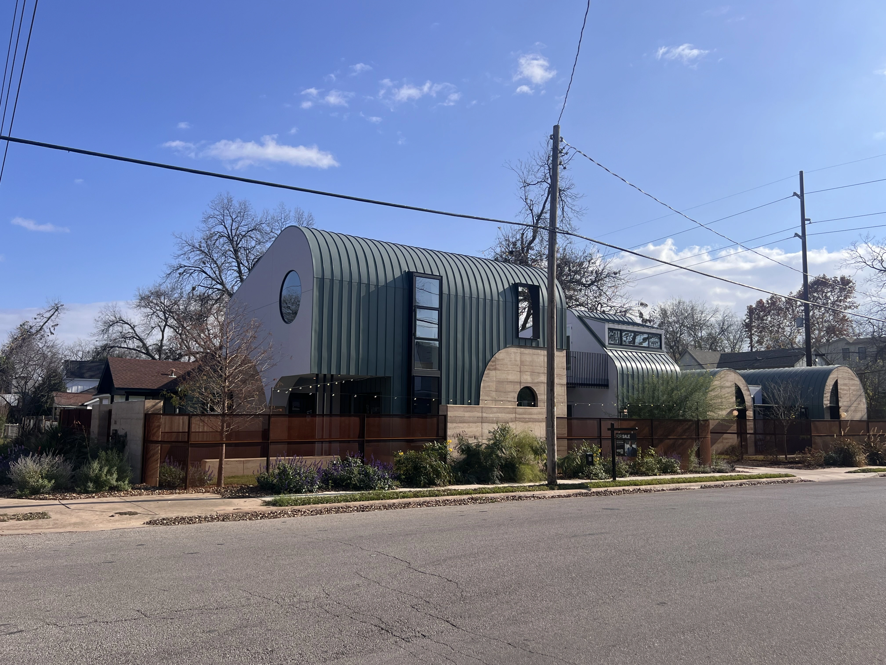

+++
title = "Austin, Texas"
date = 2026-01-01T11:00:00-08:00
[taxonomies]
authors = ["Ramnath R Iyer"]
tags = ["vacation"]
+++

Each December, we look for a warm place to spend our time, ideally one that's a stark contrast from
the gray skies, damp air and brief days of the Pacific Northwest. This time around we decided to go
to the city of Austin in Texas. Austin has decent cafes, restaurants and bars to hang out at, and
plenty of parks and lakes to spend time around. On our last day, we hiked the [River Place Canyon
Trail](https://www.riverplacelimiteddistrict.org/trails).

[One new construction](https://www.redfin.com/TX/Austin/2201-Garden-St-78702/home/34247902) stood
out during one of our walks. This was a large 3084-square-foot house with a unique architecture.

But perhaps our most novel experience during this trip was taking Uber rides in Waymo vehicles (the
autonomous and driverless ones). 

{{ video (src = "/posts/austin-texas/waymo.mov", type = "video/mov") }}
<em>Waymo's autonomous and driverless car.</em>
