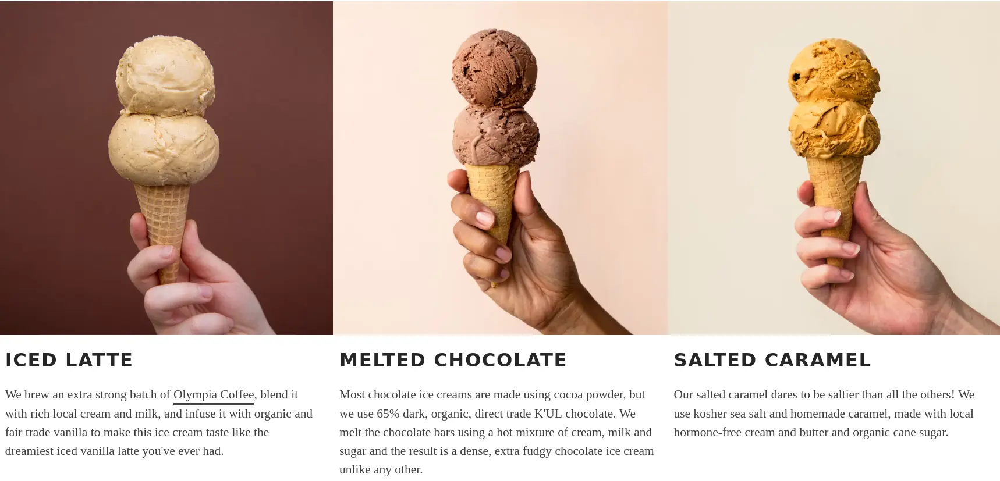

+++
title = "False Choices"
date = 2025-08-11T19:30:00-07:00
[taxonomies]
authors = ["Ramnath R Iyer"]
tags = ["lifehack"]
+++

So much of our lives are affected by false choices. By 'false choice', I mean a decision where two
options are presented to us and we make a choice without seeking out additional alternatives. Want
Iced Latte or Melted Chocolate [ice cream](https://www.mollymoon.com)? Maybe the answer should be:
Sea Salt & Caramel --- but you have to know to ask!

Perhaps this is all a magic trick that we play upon on our own minds. It is my untested hypothesis
that making the choices more detailed and intricate drives people to start focusing on its details
and become less curious about alternatives --- vanilla options, like Vanilla versus Chocolate, are
more likely to be questioned than something exotic, like Iced Latte versus Melted Chocolate.

Within a group, the options being highly detailed can fool people into believing that they've been
thought through deeply (by someone else). Some people have learned to invert the filter, and treat
excess detail as a sign of shallow synthesis. The truth probably lies somewhere in between, and so
this leads us to another type of false choice --- options being considered mutually exclusive when
they can very well co-exist, and implying a polarization when one really ought to speak of degrees
within a spectrum.

Whenever I am presented with options, say A versus B, I usually start by seeking to understand how
they came up with these options, and whether there were other options that got filtered out, based
on unspoken assumptions or constraints. Then I check to see what they are optimizing for, and pick
options that work, often going for a *mix and match* approach. The trick here is to never rule out
options but simply put a pin in it saying, "This option works *only* if constraints X, Y and Z are
broken..."

By the way, since you forgot to ask, the *right* answer to the ice cream conundrum is to have half
Raspberry, half Chocolate, with some Candied Hazelnut as a topping.

