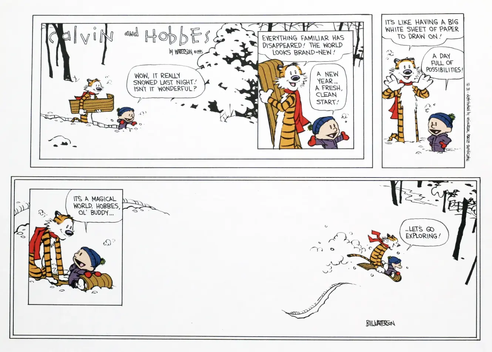

+++
title = "Hobbes"
date = 2025-07-13T17:30:00-07:00
[taxonomies]
authors = ["Ramnath R Iyer"]
tags = ["cat", "kitten", "hobbes"]
+++

I am thrilled and excited to welcome **Hobbes** into our home!

Hobbes is a snow white Bengal kitten, born on April 15th of this year. His first order of
business coming home was to explore all areas on the main level and find himself a few cozy spots.

{{ gallery (folder = "hobbes", rand = "01980723") }}

Hobbes is named after Calvin's bosom buddy and everyone's favorite tiger.

{{ borderless() }}

*Calvin and Hobbes: The Last Sunday, "Let's Go Exploring". BILL WATERSON.*
