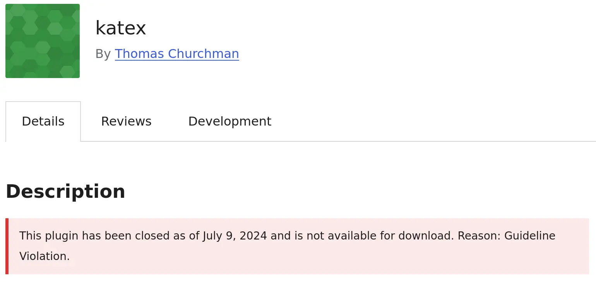

+++
title = "KaTeX"
date = 2025-07-04T21:21:00-07:00
[taxonomies]
authors = ["Ramnath R Iyer"]
tags = ["typesetting", "wordpress"]
+++

I'd [mentioned earlier](@/posts/everything-old-is-new/index.md) that I had abandoned (rather, left
frozen) my WordPress website [optimix](https://optimix.dev) and moved over to writing here instead.
Today, I wandered back to see how things looked (much like one visits an old town that they had
lived in previously). I realized that something was wrong, equations that I had typeset in
[LaTeX](https://en.wikipedia.org/wiki/LaTeX) using the [KaTeX
plugin](https://github.com/as-com/wp-katex) weren't rendering; in fact, they were throwing an ugly
error. I looked further into my WordPress admin page to discover that auto-updates were unavailable
for the plugin. Then I headed over to the [plugin page on the WordPress
website](https://wordpress.org/plugins/katex), to learn that the plugin had been "closed" (whatever
that meant) as of July 9th, 2024, because of some **"Guideline Violation"**. What the
heck!?

{{ borderless() }}

Fortunately, it turned that the already-installed plugin was actually working just fine, all I had
to do was unblock JavaScript in my browser (which I'd turned off by default via
[NoScript](https://noscript.net/) and forgotten about). For now, though I don't get further updates
for the plugin, it continues to function correctly.

I am still curious to know what that supposed "Guideline Violation" is.
