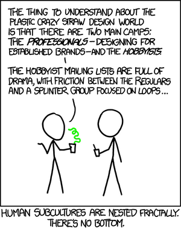

+++
title = "Quality"
date = 2025-07-06T10:00:00-07:00
[taxonomies]
tags = ["typesetting"]
+++

The vast majority of work product is mediocre at best. It takes an incredible amount of time and
effort to raise its quality to a point where one might consider it to be 'reasonably good'. But
sometimes, you run into output that is simply superlative in its quality. A cultural factor may be
at play here, for certain niches of society seem more inclined to produce such output if at all.

Consider, for example, the "Basic User Manual" of the [**memoir**
package](https://ctan.org/pkg/memoir?lang=en) for [LaTeX](https://en.wikipedia.org/wiki/LaTeX)
typesetting, available in PDF form and linked from the package page. This supposedly "basic" manual
is a whopping 625 pages long, with roughly 10 editions of the material since June 3rd,
2001. But it isn't the length of the manual alone that is impressive, what stands out is the
*degree of care* that's clearly been applied to creating the manual. At the outset, it slyly
misquotes [Ambrose Bierce](https://en.wikipedia.org/wiki/Ambrose_Bierce) --- the definition seems
fitting, but doesn't actually exist in Bierce's satirical work, *The Devil's Dictionary*.

> **memoir,** *n.* a fiction designed to flatter the subject and to impress the reader.  
> With apologies to Ambrose Bierce

From then on, it proceeds to explain useful terminology, but always with a sense of mirth hidden
behind the curtain that's waiting to pounce.

> The point system was invented by Pierre Fournier le jeune in 1737 with a length of 0.349mm. Later
> in the same century François-Ambroise Didot introduced his point system with a length of 0.3759mm.
> This is the value still used in Europe. Much later, in 1886, the American Type Founders
> Association settled on 0.013837in as the standard size for the point, and the British followed in
> 1898. Conveniently for those who are not entirely metric in their thinking this means that six
> picas are approximately equal to one inch.

And here's a brief explanation of the *ms* printing option, where the author clearly means business:

> this tries to make the document look as though it was prepared on a typewriter. Some publishers
> prefer to receive poor looking submissions.

Every detail is attended to with care, and subtly reveals the richness of thought that went into it.

Another excellent specimen within this rarified space of high quality work is the [manual for **TikZ
and PGF**](https://pgf-tikz.github.io/pgf/pgfmanual.pdf), a graphics typesetting system. Once again,
the manual oozes quality, as it walks the reader through numerous examples of everyday usage.

One wonders why, then, is it so difficult to encounter --- or create --- high quality work in our
day-to-day lives? Is it like the lottery --- you hear about the winners all the time, despite the 1
in 292,201,338 chance that they've had to beat?

<em>Source: [xkcd.com](https://xkcd.com/1095/) by Randall Munroe. License: [CC BY-NC 2.5](https://creativecommons.org/licenses/by-nc/2.5/)</em>
