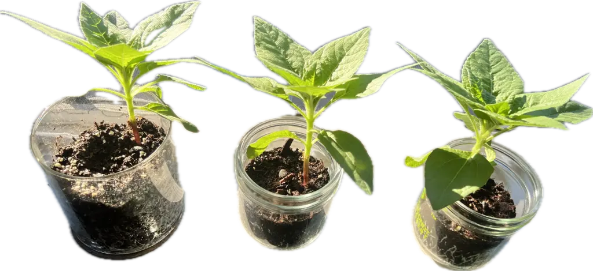

+++
title = "Sunflower Plants"
date = 2025-07-08T09:15:00-07:00
[taxonomies]
authors = ["Ramnath R Iyer"]
tags = ["plant", "garden", "home", "sunflower"]
+++

It's as simple as it sounds: we have sunflower plants by our window. I hope that in time each one of
them grows up to yield a sunflower. And of course, giving us many more seeds for many more plants.

{{ borderless() }}

