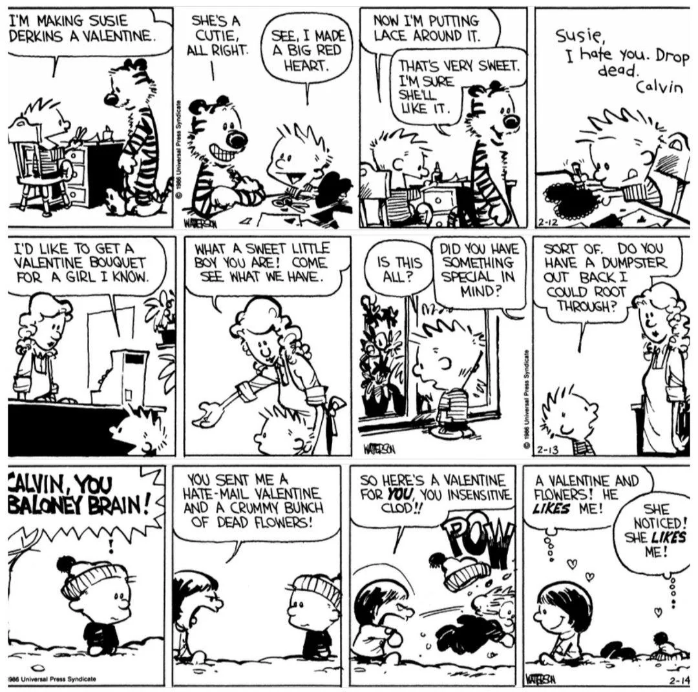

+++
title = "Susie"
date = 2025-08-23T19:30:00-07:00
[taxonomies]
authors = ["Ramnath R Iyer"]
tags = ["cat", "kitten", "susie"]
+++

I am thrilled and excited to welcome **Susie** into our home!

Susie is a rich brown Bengal kitten, born on May 10th of this year. She quickly figured
out what's what, zoomed around to explore all the nooks and crannies (she's quite a blur), and most
importantly kept [Hobbes](@/posts/hobbes/index.md) at bay by hissing and snarling at him, even as he
persisted in chasing after her (very cautiously) trying to make her feel welcome. 

{{ gallery (folder = "susie", rand = "10987023") }}

Susie is named after Calvin's nemesis --- but Hobbes knows they secretly like each other.

{{ borderless() }}

*Calvin and Hobbes: Valentine. BILL WATERSON.*
